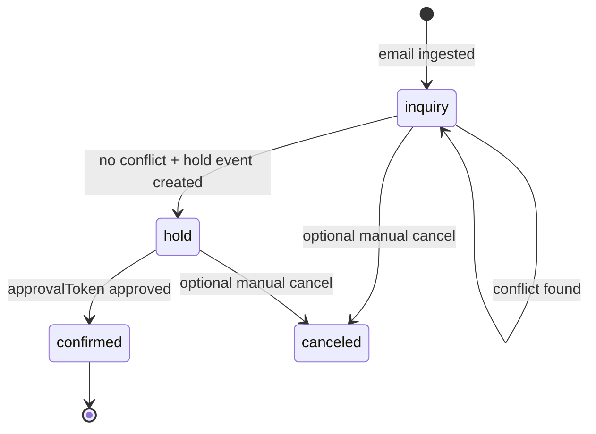

# SaaS Booking Automation Platform (API)

Production-style backend for automated booking operations. It ingests booking emails, checks scheduling conflicts, creates hold events, requests approval, confirms bookings, and maintains a durable booking ledger.

## Architecture Overview

```text
HTTP Routes
  |-- POST /email/ingest-test
  |-- POST /agent/approve
  |-- GET  /bookings
       |
       v
Services Layer
  |-- bookingParser.ts
  |-- gmail.service.ts
  |-- calendar.service.ts
  |-- booking.service.ts
  |-- agent.service.ts
       |
       v
Data Layer
  |-- db/client.ts
  |-- db/migrations/*.sql
  |-- SQLite bookings table
       |
       v
Worker Layer
  |-- workers/emailApprovalWatcher.ts
```

## Booking Lifecycle



## SaaS System Explanation

1. Ingestion endpoint reads the latest unread booking request email.
2. Parser extracts structured booking fields.
3. Booking is persisted as `inquiry`.
4. Calendar FreeBusy checks scheduling conflicts.
5. If no conflict, a hold event is created in `Booking Holds` and booking moves to `hold`.
6. Owner receives approval email containing `approvalToken`.
7. Approval endpoint validates token and confirms only bookings in `hold` state.
8. Confirmed bookings are synced to primary calendar and agency confirmation email is sent.
9. Autonomous worker monitors Gmail replies, detects `YES`, extracts token, and triggers idempotent approval.

## Local Development

1. Install dependencies:
   - `cd apps/api`
   - `bun install`
2. Configure environment:
   - copy `.env.example` to `.env`
   - set Google OAuth and workflow variables
3. Run API server:
   - `bun run dev`
4. Run approval worker:
   - `bun run worker:approval`
5. Run tests:
   - `bun run test:smoke`
   - `bun run test:bookings`
   - `bun run test:extract`
   - `bun run test:gmail`

## Logging Model

Structured logs are emitted for major workflow stages:
- `[INGEST]`
- `[CONFLICT_CHECK]`
- `[HOLD_CREATED]`
- `[APPROVAL_SENT]`
- `[BOOKING_CONFIRMED]`
