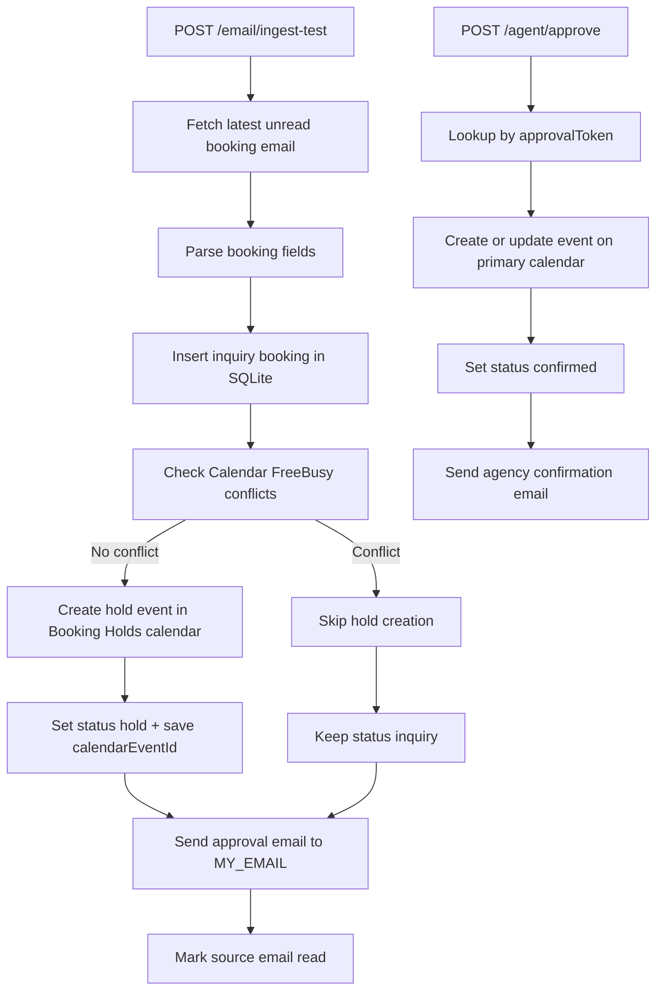

# Booking-Ops API

Backend service for email-driven booking workflow using Bun, Express, SQLite, Gmail API, and Google Calendar API.

## Architecture

```
src/
  app.ts
  index.ts
  routes/
    agent.ts
    bookings.ts
    email.ts
  services/
    agentService.ts
    bookingParser.ts
    calendarService.ts
    gmailService.ts
  lib/
    env.ts
    google-auth.ts
    logger.ts
  db/
    sqlite.ts
    bookings-repository.ts
    migrations/
      001_create_bookings.sql
  types/
    booking.ts
```

- `routes/`: HTTP transport only.
- `services/`: Gmail, Calendar, parser, and workflow orchestration.
- `db/`: SQLite initialization, migrations, and repository.
- `lib/`: shared environment, auth, and logging helpers.
- `index.ts`: server bootstrap only (no business logic).

## Workflow Diagram



## Approval Flow

1. `/email/ingest-test` ingests one unread test email and creates a booking with `approvalToken`.
2. It checks for conflicts with Google Calendar FreeBusy.
3. If clear, it creates a hold event in `Booking Holds` and sets `status=hold`.
4. It emails `MY_EMAIL` with booking details + token.
5. `/agent/approve` with that token sets `status=confirmed`, confirms event on primary calendar, and emails the agency:
   `I confirm my availability for this booking.`

## Autonomous Agent Architecture

The backend includes a background worker at `src/workers/emailApprovalWatcher.ts`:

1. Polls Gmail every `APPROVAL_WATCHER_POLL_MINUTES`.
2. Reads unread approval-reply emails using `APPROVAL_WATCHER_QUERY`.
3. Detects positive approval replies containing `YES`.
4. Extracts `approvalToken` from email body.
5. Calls `AgentService.approveBooking(approvalToken)`.

Reliability design:
- Idempotent approval: already-confirmed bookings return without duplicate confirmation side effects.
- Duplicate email safety: processed replies are marked as read.
- Overlap protection: worker skips concurrent poll execution with an in-process run lock.
- Structured logs: each poll and message decision is logged with stable event keys.

## Environment

Use `.env` with keys listed in `.env.example`.

Important:
- Do not commit secrets.
- `credentials.json`, `token.json`, and `.env` are gitignored.
- SQLite DB defaults to `apps/api/data/bookings.sqlite`.
